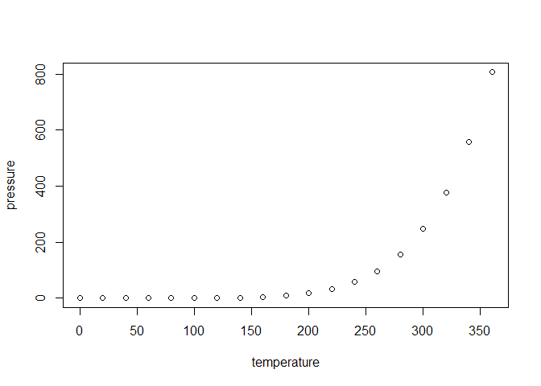

<!-- README.md is generated from README.Rmd. Please edit that file -->

# rasterbc

<!-- badges: start -->

<!-- badges: end -->

rasterbc provides a simple set of helper functions for accessing a large
set of spatial ecological data on the province of BC during the period
2001-2018, in raster format for analysis in R.

Metadata associated with these layers, and code for downloading them
from their original sources can be found in a sister repository,
[rasterbc\_src](https://github.com/deankoch/rasterbc_src), and all
raster data files will be hosted as a data publication (with associated
DOI) on [FRDR](https://www.frdr-dfdr.ca/repo/) for permanence and easy
referencing.

## Installation

This package is still in development, but a release on
[CRAN](https://CRAN.R-project.org) is planned in the near future. For
now the package may be tested by installing the `devtools` package (run
`install.packages('devtools')`), and running the following two lines:

``` r
library(devtools)
install_github('deankoch/rasterbc')
```

## Example

(boilerplate examples, to be replaced soon) This is a basic example
which shows you how to solve a common problem:

``` r
library(rasterbc)
## basic example code
```

What is special about using `README.Rmd` instead of just `README.md`?
You can include R chunks like so:

``` r
summary(cars)
#>      speed           dist       
#>  Min.   : 4.0   Min.   :  2.00  
#>  1st Qu.:12.0   1st Qu.: 26.00  
#>  Median :15.0   Median : 36.00  
#>  Mean   :15.4   Mean   : 42.98  
#>  3rd Qu.:19.0   3rd Qu.: 56.00  
#>  Max.   :25.0   Max.   :120.00
```

You’ll still need to render `README.Rmd` regularly, to keep `README.md`
up-to-date.

You can also embed plots, for example:



In that case, don’t forget to commit and push the resulting figure
files, so they display on GitHub\!
