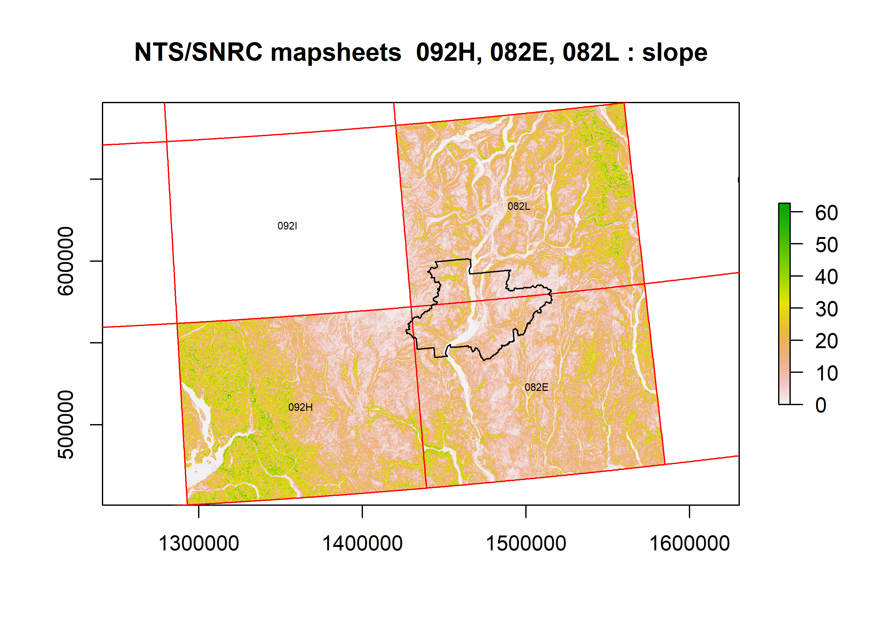
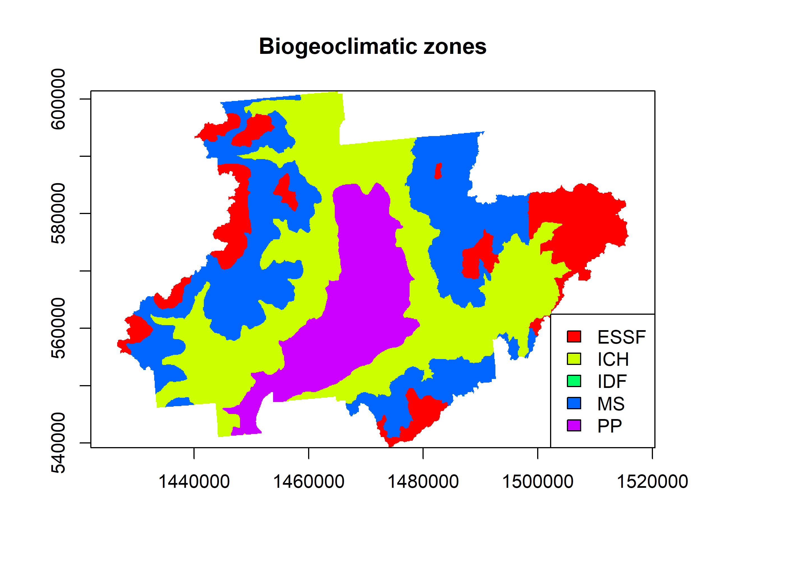

Introduction to the rasterbc package
================
Dean Koch
2021-11-18

<!-- README.md is generated from README.Rmd. Please edit that file -->

# rasterbc

<!-- badges: start -->
<!-- badges: end -->

`rasterbc` provides access to a collection of gridded spatial ecological
data on the province of BC during the period 2001-2018, in the standard
[BC Albers](https://spatialreference.org/ref/epsg/nad83-bc-albers/)
projection. This package downloads and imports the data in R as
RasterLayer objects in response to user queries. Our goal is to improve
access to a number of publicly accessible datasets on BC forests by
simplifying the (often laborious) data ingress stage of modelling.

The available layers are:

-   [BC biogeoclimatic
    zone](https://github.com/deankoch/rasterbc_src/blob/master/src_bgcz.knit.md)
    (‘bgcz’), from the [BC Ministry of
    Forests](https://catalogue.data.gov.bc.ca/dataset/f358a53b-ffde-4830-a325-a5a03ff672c3)
-   [Geographical coordinates
    grid](https://github.com/deankoch/rasterbc_src/blob/master/src_borders.knit.md)
    (‘borders’), from [Natural Resources
    Canada](https://www.nrcan.gc.ca/maps-tools-publications/maps/topographic-maps/10995)
-   [Consolidated cutblocks,
    2001-2018](https://github.com/deankoch/rasterbc_src/blob/master/src_cutblocks.knit.md)
    (‘cutblocks’), from the [BC Ministry of
    Forests](https://catalogue.data.gov.bc.ca/dataset/harvested-areas-of-bc-consolidated-cutblocks-)
-   [Digital elevation
    model](https://github.com/deankoch/rasterbc_src/blob/master/src_dem.knit.md)
    (‘dem’) from [Natural Resources
    Canada](http://ftp.geogratis.gc.ca/pub/nrcan_rncan/elevation/cdem_mnec/doc/CDEM_en.pdf)
-   [Forest insect and disease survey,
    2001-2018](https://github.com/deankoch/rasterbc_src/blob/master/src_fids.knit.md)
    (‘fids’), from the [BC Ministry of
    Forests](https://catalogue.data.gov.bc.ca/dataset/pest-infestation-polygons)
-   [Forest extent and change,
    2001-2019](https://github.com/deankoch/rasterbc_src/blob/master/src_gfc.knit.md)
    (‘gfc’), from [Hansen et
    al., (2013)](https://www.nrcresearchpress.com/doi/full/10.1139/cjfr-2013-0401)
-   [Canadian national fire database,
    2001-2018](https://github.com/deankoch/rasterbc_src/blob/master/src_nfdb.knit.md)
    (‘nfdb’), from [Natural Resources
    Canada](https://cwfis.cfs.nrcan.gc.ca/ha/nfdb)
-   [Interpolated forest attributes, 2001,
    2011](https://github.com/deankoch/rasterbc_src/blob/master/src_pine.knit.md)
    (‘pine’) from [Beaudoin et
    al. (2017)](https://www.nrcresearchpress.com/doi/full/10.1139/cjfr-2017-0184)

These datasets were downloaded and processed in the years 2018-2020
(follow links above for code and documentation on this process), then
stored as raster tiles hosted on [FRDR](https://www.frdr-dfdr.ca/repo/)
in the form of [a data
publication](https://www.frdr-dfdr.ca/repo/handle/doi:10.20383/101.0283)
(with associated [DOI](https://doi.org/10.20383/101.0283)) for
permanence and easy referencing.

</img>
</img>
</img>

## Releases

`rasterbc` is not yet available on CRAN but it can be downloaded and
installed in R using the command

``` r
devtools::install_github('deankoch/rasterbc')
```

See the [introduction
vignette](https://github.com/deankoch/rasterbc/blob/master/vignette_intro.md)
([pdf
link](https://github.com/deankoch/rasterbc/blob/master/vignette_intro.pdf))
for instructions on getting started with this package.

## About

This project grew out of my [doctoral thesis
project](https://doi.org/10.7939/r3-91zn-v276) on modelling outbreaks of
the mountain pine beetle in central BC. Parts of of the `rasterbc`
collection can be found in research publications with professors Mark
Lewis and Subhash Lele on [statistical methods for spatial
data](https://doi.org/10.7939/r3-g6qb-bq70), [models for animal
dispersal](https://doi.org/10.1098/rsif.2020.0434), and [an analysis of
MPB activity in the Merrit
TSA](https://doi.org/10.1007/s11538-021-00899-z). We gratefully
acknowledge the support of NSERC, TRIA-Net, and the University of
Alberta Lewis Lab in this work.

## News

**2021/11/16**

Updates to fix broken URLs and remove dependency on gdalUtils

**2020/09/22**

Data publication is now finalized at FRDR

**2020/09/18**

All data (including ‘cutblocks’) have now been uploaded to FRDR’s main
site. A DOI for the dataset and some updated links are forthcoming.

**2020/07/07**

Some major changes in today’s commits: Function `listdata_bc` now has
cleaner and more detailed information printout, with boolean return
values as an optional (mostly internal) feature; `datadir_bc` arguments
have been simplified; `getdata_bc` now loads/merges data by default

**2020/07/05**

All collections except ‘cutblocks’ are now on [FRDR’s demo
site](https://demo.frdr-dfdr.ca/repo/handle/doi:10.80217/demo.278?mode=full),
and can be accessed via this package.

**2020/06/30**

A development version is now ready for installation from github. For
now, only the ‘dem’ collection (‘dem’, ‘aspect’, ‘slope’) is accessible
online from FRDR. A beta version with all layers, except possibly
‘harvest’ from collection ‘cutblocks’ (copyright permission request
pending), is planned for release around July 10, 2020.

<!-- README.md is generated from README.Rmd. Please edit that file -->
<!-- rmarkdown::render('README.Rmd') -->
