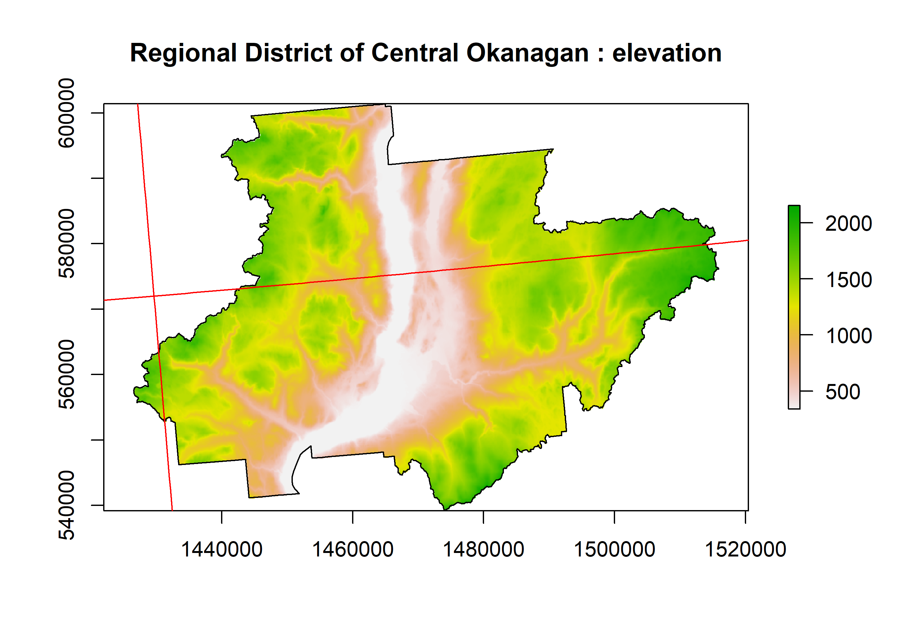

<!-- README.md is generated from README.Rmd. Please edit that file -->

# rasterbc

<!-- badges: start -->

<!-- badges: end -->

rasterbc provides a set of helper functions for accessing a large
collection of spatial ecological data on the province of BC during the
period 2001-2018, in a common (gridded) raster format. The goal is to
make this data more accessible and easier to import into R, for the
benefit of modelers interested in the forest ecology of BC.

Links to metadata associated with these layers, and code for downloading
them from their original sources can be found in a sister repository,
[rasterbc\_src](https://github.com/deankoch/rasterbc_src). Links to the
documentation for this code, and to the original sources, are listed
below:

  - [BC biogeoclimatic
    zone](https://github.com/deankoch/rasterbc_src/blob/master/src_bgcz.knit.md)
    (‘bgcz’), from the [BC Ministry of
    Forests](https://catalogue.data.gov.bc.ca/dataset/f358a53b-ffde-4830-a325-a5a03ff672c3)
  - [Geographical coordinates
    grid](https://github.com/deankoch/rasterbc_src/blob/master/src_borders.knit.md)
    (‘borders’), from [Natural Resources
    Canada](https://www.nrcan.gc.ca/maps-tools-publications/maps/topographic-maps/10995)
  - [Consolidated
    cutblocks, 2001-2018](https://github.com/deankoch/rasterbc_src/blob/master/src_cutblocks.knit.md)
    (‘cutblocks’), from the [BC Ministry of
    Forests](https://catalogue.data.gov.bc.ca/dataset/harvested-areas-of-bc-consolidated-cutblocks-)
  - [Digital elevation
    model](https://github.com/deankoch/rasterbc_src/blob/master/src_dem.knit.md)
    (‘dem’) from [Natural Resources
    Canada](http://ftp.geogratis.gc.ca/pub/nrcan_rncan/elevation/cdem_mnec/doc/CDEM_en.pdf)
  - [Forest insect and disease
    survey, 2001-2018](https://github.com/deankoch/rasterbc_src/blob/master/src_fids.knit.md)
    (‘fids’), from the [BC Ministry of
    Forests](https://catalogue.data.gov.bc.ca/dataset/pest-infestation-polygons)
  - [Forest extent and
    change, 2001-2019](https://github.com/deankoch/rasterbc_src/blob/master/src_gfc.knit.md)
    (‘gfc’), from [Hansen et
    al., 2013](https://www.nrcresearchpress.com/doi/full/10.1139/cjfr-2013-0401)
  - [Canadian national fire
    database, 2001-2018](https://github.com/deankoch/rasterbc_src/blob/master/src_nfdb.knit.md)
    (‘nfdb’), from [Natural Resources
    Canada](https://cwfis.cfs.nrcan.gc.ca/ha/nfdb)
  - [Interpolated forest
    attributes, 2001, 2011](https://github.com/deankoch/rasterbc_src/blob/master/src_pine.knit.md)
    (‘pine’) from [Beaudoin et
    al. (2017)](https://www.nrcresearchpress.com/doi/full/10.1139/cjfr-2017-0184)

All raster data files are hosted as [a data
publication](https://www.frdr-dfdr.ca/repo/handle/doi:10.20383/101.0283)
(with associated [DOI](https://doi.org/10.20383/101.0283)) on
[FRDR](https://www.frdr-dfdr.ca/repo/) for permanence and easy
referencing.

## News

**22/09/2020**

Data publication is now finalized at FRDR

**18/09/2020**

All data (including ‘cutblocks’) have now been uploaded to FRDR’s main
site. A DOI for the dataset and some updated links are forthcoming.

**07/07/2020**

Some major changes in today’s commits: Function `listdata_bc` now has
cleaner and more detailed information printout, with boolean return
values as an optional (mostly internal) feature; `datadir_bc` arguments
have been simplified; `getdata_bc` now loads/merges data by default

**05/07/2020**

All collections except ‘cutblocks’ are now on [FRDR’s demo
site](https://demo.frdr-dfdr.ca/repo/handle/doi:10.80217/demo.278?mode=full),
and can be accessed via this package.

**30/06/2020**

A development version is now ready for installation from github. For
now, only the ‘dem’ collection (‘dem’, ‘aspect’, ‘slope’) is accessible
online from FRDR. A beta version with all layers, except possibly
‘harvest’ from collection ‘cutblocks’ (copyright permission request
pending), is planned for release around July 10, 2020.

## Installation

This package is still in development, but a release on
[CRAN](https://CRAN.R-project.org) is planned in the near future. For
now the package may be tested by installing the `devtools` package (run
`install.packages('devtools')`), and then running the following two
lines:

``` r
library(devtools)
install_github('deankoch/rasterbc')
```

I have tried to keep dependencies to a minimum. Currently, the package
requires: `rappdirs` (for an automated storage directory selection); and
`sf`, `raster`, `gdalUtils` (for GIS work). If these are not already
installed on your machine, the `install_github` line will ask to install
them.

## Local data storage

`rasterbc` is a data-retrieval tool. Start by setting a storage
directory for the raster layers:

``` r
library(rasterbc)
datadir_bc('H:/rasterbc_data')
#> [1] "data storage path set to: H:/rasterbc_data"
#> [1] "directory exists"
#> Warning in datadir_bc("H:/rasterbc_data"): warning: this directory appears to be
#> non-empty. Contents may be overwritten!
#> [1] "H:/rasterbc_data"
```

If this directory contains any files/folders (eg. if you have used
`rasterbc` before with this directory), a warning message is printed.
This is to caution users that if the storage directory has existing
files matching those fetched by the `rasterbc` package, those data can
be overwritten. This can only happen via calls of the form
`raster::getdata_bc(..., force.dl=TRUE)`. However, to be safe you should
set the data directory to a path that won’t used by other applications;
*eg.* a subfolder of your home directory or external storage device,
with a unique folder name.

This path string is stored as an R option. View it using:

``` r
print(getOption('rasterbc.data.dir'))
#> [1] "H:/rasterbc_data"
```

Depending on the geographical extent of interest and the number
different layers requested, the storage demands can be high. For
example, if every layer is downloaded, then around 30 GB of space is
needed. Make sure you have selected a drive with enough free space for
your project.

## Getting started

To demonstrate this package we’ll need a polygon covering a (relatively)
small geographical extent in BC. Start by loading the
[bcmaps](https://github.com/bcgov/bcmaps) package and grabbing the
polygons for the BC provincial boundary and the [Central Okanagan
Regional District](https://www.regionaldistrict.com/)

``` r
library(bcmaps)
#> Loading required package: sf
#> Linking to GEOS 3.8.0, GDAL 3.0.4, PROJ 6.3.1

# define and load the geometry
example.name = 'Regional District of Central Okanagan'
bc.bound.sf = bc_bound()
districts.sf = regional_districts()
example.sf = districts.sf[districts.sf$ADMIN_AREA_NAME==example.name, ]

# plot against map of BC
plot(st_geometry(ntspoly_bc), main=example.name, border='red')
plot(st_geometry(bc.bound.sf), add=TRUE, col=adjustcolor('blue', alpha.f=0.2))
plot(st_geometry(example.sf), add=TRUE, col=adjustcolor('yellow', alpha.f=0.5))
text(st_coordinates(st_centroid(st_geometry(ntspoly_bc))), labels=ntspoly_bc$NTS_SNRC, cex=0.5)
```


The Okanagan polygon is shown in yellow, against a red grid that
partitions the geographic extent of the province into 89 smaller
regions, called *mapsheets*. This is the
[NTS/SNRC](https://www.nrcan.gc.ca/maps-tools-publications/maps/topographic-maps/10995)
grid used by Natural Resources Canada for their topographic maps, with
each mapsheet identied by a [unique number-letter
code](https://www.nrcan.gc.ca/earth-sciences/geography/topographic-information/maps/9765).
`rasterbc` uses this grid to package data into blocks for distribution.
It is lazy-loaded as the `sf` object `ntspoly_bc`:

``` r
print(ntspoly_bc)
#> Simple feature collection with 89 features and 1 field
#> geometry type:  POLYGON
#> dimension:      XY
#> bbox:           xmin: 199960.5 ymin: 331658 xmax: 1874986 ymax: 1745737
#> projected CRS:  NAD83 / BC Albers
#> First 10 features:
#>    NTS_SNRC                       geometry
#> 1      092B POLYGON ((1299175 340112.5,...
#> 2      092C POLYGON ((1149647 333772, 1...
#> 3      092E POLYGON ((854708.4 444669.3...
#> 4      092F POLYGON ((1001221 442634.1,...
#> 5      092G POLYGON ((1147733 444738.3,...
#> 6      092H POLYGON ((1294127 450980.4,...
#> 7      083C POLYGON ((1548365 807589.3,...
#> 8      083D POLYGON ((1411944 794023.1,...
#> 9      083E POLYGON ((1402477 905139.5,...
#> 10     082E POLYGON ((1440286 461355.4,...
```

## A basic example

Let’s download Canada’s 1:250,000 digital elevation model
([CDEM](http://ftp.geogratis.gc.ca/pub/nrcan_rncan/elevation/cdem_mnec/doc/CDEM_product_specs.pdf))
layers corresponding to the yellow polygon. For the full BC extent,
these rasters would occupy around 1.2GB of space. But we only want the
smaller extent corresponding to the polygon. There are three blocks
(totalling about 20 MB) which overlap with our region of interest

``` r
findblocks_bc(example.sf)
#> [1] "092H" "082E" "082L"
```

fetch them using the command:

``` r
getdata_bc(geo=example.sf, collection='dem', varname='dem', load.mosaic=FALSE)
```

You should see progress bars for a series of three downloads, and once
finished, the paths of the downloaded files are printed to the console.
Note that if a block has been downloaded already (*eg.* by a
`getdata_bc` call with a different `geo` argument), the existing copy
will be detected, and the download skipped. *eg.* repeat the call…

``` r
getdata_bc(geo=example.sf, collection='dem', varname='dem', load.mosaic=FALSE)
#> [1] "all 3 block(s) found in local data storage. Nothing to download"
#> [1] "H:/rasterbc_data/dem/blocks/dem_092H.tif"
#> [2] "H:/rasterbc_data/dem/blocks/dem_082E.tif"
#> [3] "H:/rasterbc_data/dem/blocks/dem_082L.tif"
```

… and nothing happens, because the data are there already. Verify by
loading one of the files as `RasterLayer`:

``` r
library(raster)
#> Loading required package: sp
example.raster = raster('H:/rasterbc_data/dem/blocks/dem_092H.tif')
print(example.raster)
#> class      : RasterLayer 
#> dimensions : 1212, 1525, 1848300  (nrow, ncol, ncell)
#> resolution : 100, 100  (x, y)
#> extent     : 1286588, 1439088, 450888, 572088  (xmin, xmax, ymin, ymax)
#> crs        : +proj=aea +lat_0=45 +lon_0=-126 +lat_1=50 +lat_2=58.5 +x_0=1000000 +y_0=0 +datum=NAD83 +units=m +no_defs 
#> source     : H:/rasterbc_data/dem/blocks/dem_092H.tif 
#> names      : dem_092H 
#> values     : 7.653875, 2608.961  (min, max)
plot(example.raster, main='elevation (metres)')
```


### Loading/merging blocks

To display the elevation data for the entire district, we need to
combine the three blocks downloaded earlier. This can be done using
`getdata_bc` with `load.mosaic=TRUE` (the default setting), which loads
all required blocks, merges them into a single (mosaic) layer, crops and
masks as needed, and then loads into memory the returned `RasterLayer`
object:

``` r
example.tif = getdata_bc(example.sf, collection='dem', varname='dem')
#> [1] "all 3 block(s) found in local data storage. Nothing to download"
#> [1] "output to temporary file: C:/Users/deank/AppData/Local/Temp/RtmpM9YqF0/file22a45c0327c.tif"
#> [1] "creating mosaic of 3 block(s)"
#> 
#> Attaching package: 'gdalUtils'
#> The following object is masked from 'package:sf':
#> 
#>     gdal_rasterize
#> [1] "H:/rasterbc_data/dem/blocks/dem_092H.tif"
#> [2] "H:/rasterbc_data/dem/blocks/dem_082E.tif"
#> [3] "H:/rasterbc_data/dem/blocks/dem_082L.tif"
#> [1] "clipping layer..."
#> [1] "masking layer..."
print(example.tif)
#> class      : RasterLayer 
#> dimensions : 622, 893, 555446  (nrow, ncol, ncell)
#> resolution : 100, 100  (x, y)
#> extent     : 1426588, 1515888, 539188, 601388  (xmin, xmax, ymin, ymax)
#> crs        : +proj=aea +lat_0=45 +lon_0=-126 +lat_1=50 +lat_2=58.5 +x_0=1000000 +y_0=0 +datum=NAD83 +units=m +no_defs 
#> source     : memory
#> names      : dem 
#> values     : 340.43, 2153.29  (min, max)
plot(example.tif, main=paste(example.name, ': elevation'))
plot(st_geometry(example.sf), add=TRUE)
plot(st_geometry(ntspoly_bc), add=TRUE, border='red')
```



Note that any simple features object of class `sf` or `sfc` could be
used for the argument `geo`, provided its geometry intersects with the
provincial boundary of BC. However, the intended usage is for the user
to delineate their region of interest as a `(MULTI)POLYGON` object
(here, `example.sf` is a `MULTIPOLYGON`). Note that geometries of other
classes (such `SpatialPolygons`, as defined by `sp`; or data frames
containing coordinates of vertices) can often be coerced to `sf` using a
command like `sf::st_as_sf(other_geometry_class_object)`.

Alternatively, users can directly download individual blocks by
specifying their their NTS/SNRC codes, *eg.*

``` r
example.blockcodes = c('092B', '092C')
example.tif = getdata_bc(example.blockcodes, collection='dem', varname='slope')
#> [1] "[dem]:[slope] downloading 2 block(s) to: H:/rasterbc_data/dem"
#>   |        ||   0%  |        ||  50%[1] " writing to: dem/blocks/slope_092B.tif"
#>   |        || 100%[1] " writing to: dem/blocks/slope_092C.tif"
#> 
#> [1] "output to temporary file: C:/Users/deank/AppData/Local/Temp/RtmpM9YqF0/file22a440897d0e.tif"
#> [1] "creating mosaic of 2 block(s)"
#> [1] "H:/rasterbc_data/dem/blocks/slope_092B.tif"
#> [2] "H:/rasterbc_data/dem/blocks/slope_092C.tif"
#> [1] "loading block(s)"
plot(example.tif, main=paste('NTS/SNRC mapsheets ', paste(example.blockcodes, collapse=', '), ': slope'))
plot(st_geometry(ntspoly_bc), add=TRUE, border='red')
text(st_coordinates(st_centroid(st_geometry(ntspoly_bc))), labels=ntspoly_bc$NTS_SNRC, cex=0.5)
```


### File management

If you forget which files have been downloaded, you can either check the
directory `data.dir` using your file browser (subfolder ‘/dem/blocks’,
in this case), or use the convenience function `listfiles_bc` to get a
boolean vector indicating which files have been detected in your local
storage directory:

``` r
is.downloaded = listdata_bc(collection='dem', varname='dem', return.boolean=TRUE)
str(is.downloaded)
#>  Named logi [1:89] FALSE FALSE FALSE FALSE FALSE TRUE ...
#>  - attr(*, "names")= chr [1:89] "dem/blocks/dem_092B.tif" "dem/blocks/dem_092C.tif" "dem/blocks/dem_092E.tif" "dem/blocks/dem_092F.tif" ...
sum(is.downloaded)
#> [1] 3
length(is.downloaded)
#> [1] 89
```

This shows that of the 89 blocks for the variable name ‘dem’ (in the
collection ‘dem’), we have downloaded three so far. Notice the return
value of `listdata_bc` is a *named* vector, with names indicating the
destination filenames and paths. This shows where they will be written
by `getdata_bc`. All filenames are either of the form
‘varname\_mapsheet.tif’ (as in this example) or else
varname\_year\_mapsheet.tif (for time-series data).

By default, the `listdata_bc` function prints a list of all available
layers. *eg.* in the ‘dem’ collection we also have ‘aspect’ and ‘slope’:

``` r
listdata_bc(collection='dem', verbose=2)
#>        year                        description                                  unit blocks.downloaded
#> dem      NA              digital elevation map              (metres above sea level)              3/89
#> slope    NA derived from digital elevation map            (degrees above horizontal)              2/89
#> aspect   NA derived from digital elevation map (degrees counterclockwise from north)              0/89
```

And we now see listed the two ‘slope’ blocks (for southern Vancouver
island) that were downloaded manually using NTS/SNRC codes. Recall that
we merged the two blocks earlier on with a `opendata_bc` function call
that created a single `RasterLayer`. Currently, this layer resides ‘in
memory’ and can be accessed via the R object `example.tif`. To save a
copy, one can use the `raster::writeRaster` function. *eg.*

``` r
victoria_slope.path = file.path(getOption('rasterbc.data.dir'), 'dem', 'victoria_slope.tif')
writeRaster(example.tif, victoria_slope.path, overwrite=TRUE)
```

`getdata_bc` writes all of its data inside a ‘blocks’ subdirectory (in
this case ‘/dem/blocks’), and the subfolder of the data directory
corresponding to the collection (in this case ‘/dem’) is, by default,
left empty. So it is a good place to store and organize such derivative
files, where they can be loaded more quickly (in future), *eg.*

``` r
raster(victoria_slope.path)
#> class      : RasterLayer 
#> dimensions : 913, 2992, 2731696  (nrow, ncol, ncell)
#> resolution : 100, 100  (x, y)
#> extent     : 999987.5, 1299188, 359688, 450988  (xmin, xmax, ymin, ymax)
#> crs        : +proj=aea +lat_0=45 +lon_0=-126 +lat_1=50 +lat_2=58.5 +x_0=1000000 +y_0=0 +datum=NAD83 +units=m +no_defs 
#> source     : H:/rasterbc_data/dem/victoria_slope.tif 
#> names      : victoria_slope 
#> values     : 0, 55.09229  (min, max)
```

If you’re finished with `rasterbc` and want to remove all of the stored
data, or if you simply want to free up space, the entire data directory
or any of its contents can be deleted using your file browser. This will
not break the `rasterbc` installation. However, all downloaded data will
be erased and you will need to run `datadir_bc` again before using the
other package functions.

### Integer codes

Note that the `bgcz` collection data are factors, which are then encoded
in the geotiff files as integer codes. In a future release, we plan to
load these factor names automatically as a raster attribute table for
the `RasterLayer` object. However, for now, the lookup tables can be
accessed using the following command.

``` r
lookup.list = rasterbc::metadata_bc$bgcz$metadata$coding

# eg. for region, 1=CARIBOO, 2=KOOTENAY / BOUNDARY, etc
print(lookup.list$region)
#> [1] "CARIBOO"            
#> [2] "KOOTENAY / BOUNDARY"
#> [3] "NORTHEAST"          
#> [4] "OMINECA"            
#> [5] "SKEENA"             
#> [6] "SOUTH COAST"        
#> [7] "THOMPSON / OKANAGAN"
#> [8] "WEST COAST"
```

<!-- README.md is generated from README.Rmd. Please edit that file -->

<!-- rmarkdown::render('README.Rmd') -->
