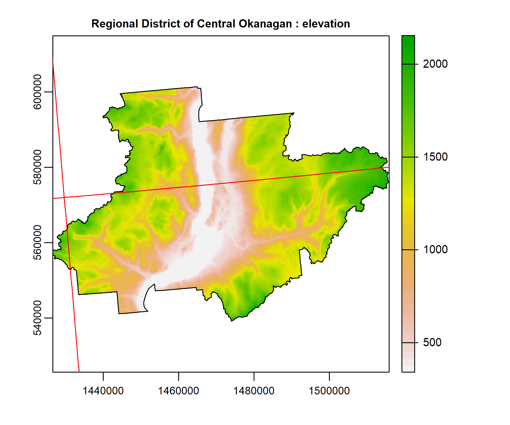

## Installation

This package is published on [CRAN](https://CRAN.R-project.org/package=rasterbc). Install it with:


```r
install_packages('rasterbc')
```
I have tried to keep dependencies to a minimum. The package requires `sf` and `terra` for loading and merging geospatial data. If these are not already installed on your machine, the `install_github` line will ask to install them. We also use the `bcmaps` package in this vignette to define a study region (but it's not a requirement of the package).


```r
library(sf)
#> Linking to GEOS 3.9.1, GDAL 3.2.1, PROJ 7.2.1
library(terra)
#> terra version 1.4.22
library(bcmaps)
#> The bcmapsdata package is no longer required to be installed for bcmaps to function.
#> Layers are now cached as needed to 'C:\Users\deank\AppData\Local/R/cache/R/bcmaps' using the bcdata package.
library(rasterbc)
```

## Local data storage

`rasterbc` is a data-retrieval tool. Start by setting a storage directory for the raster layers


```r
# replace 'C:/rasterbc_data' with your own path
datadir_bc('C:/rasterbc_data', quiet=TRUE)
```

`datadir_bc` will set the data directory to the path provided in its first argument.
Setting the first argument to `NA` (or failing to call `datadir_bc` before `getdata_bc`) will cause
the package to select a temporary directory (`base::tempdir`) that is emptied after your R session ends. We
recommended to pick a more permanent location, as in the example above, so that files only need to be downloaded once.

When `quiet=FALSE` (the default), the function will ask users to confirm that `rasterbc` should write files
to the supplied directory, and warn if this directory contains any existing files/folders. Note that if the
storage directory has existing files with names matching those fetched by the `rasterbc` package, those data
will be overwritten by calls of the form `getdata_bc(..., force.dl=TRUE)` (the default is `force.dl=FALSE`).

In future sessions, users can set `quiet=TRUE` to skip the interactive prompt and suppress warnings about existing data.

This path string is stored as an R option. View it using:

```r
datadir_bc()
#> current data storage path: C:/rasterbc_data
```

Depending on the geographical extent of interest and the number different layers requested, the storage demands can be high. For example, if every layer is downloaded, then around 30 GB of space is needed. Make sure you have selected a drive with enough free space for your project.

## Getting started

To demonstrate this package we'll need a polygon covering a (relatively) small geographical extent in BC. Start by loading the [bcmaps](https://github.com/bcgov/bcmaps) package and grabbing the polygons for the BC provincial boundary and the [Central Okanagan Regional District](https://www.rdco.com/en/index.aspx)


```r
# define and load the geometry
example.name = 'Regional District of Central Okanagan'
bc.bound.sf = bc_bound()
#> bc_bound_hres was updated on 2021-11-16
districts.sf = regional_districts()
example.sf = districts.sf[districts.sf$ADMIN_AREA_NAME==example.name, ]

# plot against map of BC
blocks = findblocks_bc(type='sfc')
plot(st_geometry(blocks), main=example.name, border='red')
plot(st_geometry(bc.bound.sf), add=TRUE, col=adjustcolor('blue', alpha.f=0.2))
plot(st_geometry(example.sf), add=TRUE, col=adjustcolor('yellow', alpha.f=0.5))
text(st_coordinates(st_centroid(st_geometry(blocks))), labels=blocks$NTS_SNRC, cex=0.5)
```


The Okanagan polygon is shown in yellow, against a red grid that partitions the geographic extent of the province into 89 smaller regions, called *mapsheets* (here I am calling them "blocks"). This is the [NTS/SNRC](https://www.nrcan.gc.ca/maps-tools-and-publications/maps/topographic-maps/10995)
grid used by Natural Resources Canada for their topographic maps, with each mapsheet identified by a
[unique number-letter code](https://www.nrcan.gc.ca/earth-sciences/geography/topographic-information/maps/9765).
`rasterbc` uses this grid to package data into blocks for distribution. It is lazy-loaded as the `sf` object returned by `findblocks_bc(type='sfc')`, which we copied to variable `blocks` in the chunk above


```r
print(blocks)
#> Simple feature collection with 89 features and 1 field
#> Geometry type: POLYGON
#> Dimension:     XY
#> Bounding box:  xmin: 199960.5 ymin: 331658 xmax: 1874986 ymax: 1745737
#> Projected CRS: NAD83 / BC Albers
#> First 10 features:
#>    NTS_SNRC                       geometry
#> 1      092B POLYGON ((1299175 340112.5,...
#> 2      092C POLYGON ((1149647 333772, 1...
#> 3      092E POLYGON ((854708.4 444669.3...
#> 4      092F POLYGON ((1001221 442634.1,...
#> 5      092G POLYGON ((1147733 444738.3,...
#> 6      092H POLYGON ((1294127 450980.4,...
#> 7      083C POLYGON ((1548365 807589.3,...
#> 8      083D POLYGON ((1411944 794023.1,...
#> 9      083E POLYGON ((1402477 905139.5,...
#> 10     082E POLYGON ((1440286 461355.4,...
```

## A basic example

Let's download Canada's 1:250,000 digital elevation model ([CDEM](https://ftp.maps.canada.ca/pub/nrcan_rncan/elevation/cdem_mnec/doc/CDEM_product_specs.pdf))
layers corresponding to the yellow polygon. For the full BC extent, these rasters would occupy around 1.2GB of space. But we only want the smaller extent corresponding to the polygon. There are three blocks (totalling about 20 MB) which overlap with our region of interest


```r
findblocks_bc(example.sf)
#> [1] "092H" "082E" "082L"
```

fetch them using the command:


```r
getdata_bc(geo=example.sf, collection='dem', varname='dem')
```

You should see progress bars for a series of three downloads, and once finished, the paths of the downloaded files are printed to the console. Note that if a block has been downloaded already (*eg.* by a `getdata_bc` call with a different `geo` argument), the existing copy will be detected, and the download skipped. *eg.* repeat the call...


```r
getdata_bc(geo=example.sf, collection='dem', varname='dem')
#> all 3 block(s) found in local data storage. Nothing to download
#> [1] "C:/rasterbc_data/dem/blocks/dem_092H.tif"
#> [2] "C:/rasterbc_data/dem/blocks/dem_082E.tif"
#> [3] "C:/rasterbc_data/dem/blocks/dem_082L.tif"
```

... and nothing is downloaded, because the data are there already. Verify by loading one of the files as `SpatRaster`:


```r

tif.path = file.path(datadir_bc(), 'dem/blocks/dem_092H.tif')
#> current data storage path: C:/rasterbc_data
example.raster = terra::rast(tif.path)
print(example.raster)
#> class       : SpatRaster 
#> dimensions  : 1212, 1525, 1  (nrow, ncol, nlyr)
#> resolution  : 100, 100  (x, y)
#> extent      : 1286588, 1439088, 450888, 572088  (xmin, xmax, ymin, ymax)
#> coord. ref. : +proj=aea +lat_0=45 +lon_0=-126 +lat_1=50 +lat_2=58.5 +x_0=1000000 +y_0=0 +datum=NAD83 +units=m +no_defs 
#> source      : dem_092H.tif 
#> name        : dem_092H 
#> min value   : 7.653875 
#> max value   : 2608.961
plot(example.raster, main='elevation (metres)')
```


### Loading/merging blocks

To display the elevation data for the entire district, we need to combine the three blocks downloaded earlier. This can be done using `opendata_bc`, which loads all required blocks, merges them into a single layer, crops and masks as needed, and then loads into memory the returned `SpatRaster` object:

```r
example.tif = opendata_bc(example.sf, collection='dem', varname='dem')
#> creating mosaic of 3 block(s)
#> clipping layer...masking layer...done
print(example.tif)
#> class       : SpatRaster 
#> dimensions  : 622, 893, 1  (nrow, ncol, nlyr)
#> resolution  : 100, 100  (x, y)
#> extent      : 1426588, 1515888, 539188, 601388  (xmin, xmax, ymin, ymax)
#> coord. ref. : +proj=aea +lat_0=45 +lon_0=-126 +lat_1=50 +lat_2=58.5 +x_0=1000000 +y_0=0 +datum=NAD83 +units=m +no_defs 
#> source      : memory 
#> name        :     dem 
#> min value   :  340.43 
#> max value   : 2153.29
plot(example.tif, main=paste(example.name, ': elevation'))
plot(st_geometry(example.sf), add=TRUE)
plot(st_geometry(blocks), add=TRUE, border='red')
```



If you're opening the downloaded data right away, you can skip the `getdata_bc` call. The argument `dl` (by default `TRUE`) in `opendata_bc` will cause it to call `getdata_bc` automatically to download any missing blocks.

Any simple features object of class `sf` or `sfc` can be used for the argument `geo`, provided its geometry intersects with the provincial boundary of BC. The intended usage is for the user to delineate their region of interest as a `(MULTI)POLYGON` object (here, `example.sf` is a `MULTIPOLYGON`). Geometries of other classes (such `SpatialPolygons`, as defined by `sp`; or data frames containing coordinates of vertices) can often be coerced to `sf` using a command like `sf::st_as_sf(other_geometry_class_object)`. Alternatively, users can directly download individual blocks by specifying their NTS/SNRC codes, *eg.* the next chunk plots the DEM again, using the codes:

```r
example.codes = findblocks_bc(example.sf)
example.tif = opendata_bc(example.codes, collection='dem', varname='dem')
#> creating mosaic of 3 block(s)
#> done
plot(example.tif, main=paste('NTS/SNRC mapsheets ', paste(example.codes, collapse=', '), ': elevation'))
plot(st_geometry(blocks), add=TRUE, border='red')
plot(st_geometry(example.sf), add=TRUE)
text(st_coordinates(st_centroid(st_geometry(blocks))), labels=blocks$NTS_SNRC, cex=0.5)
```


### File management

If you forget which files have been downloaded, you can either check the directory `data.dir` using your file browser (subfolder '/dem/blocks', in this case), or use `listfiles_bc` to get a logical vector indicating which files are currently found in your local storage directory:


```r
is.downloaded = listdata_bc(collection='dem', varname='dem', simple=TRUE)
paste('downloaded: ', sum(is.downloaded), '/', length(is.downloaded)) |> print()
#> [1] "downloaded:  3 / 89"
```

This shows that of the 89 blocks for the variable name 'dem' (in the collection 'dem'), we have downloaded three so far. Notice the return value of `listdata_bc` is a *named* vector, with names indicating the destination filenames and paths. This shows where they will be written by `getdata_bc`. All filenames are either of the form 'varname_mapsheet.tif' (as in this example) or else varname_year_mapsheet.tif (for time-series data).

By default, the `listdata_bc` function prints a list of all available layers. *eg.* in the 'dem' collection we also have 'aspect' and 'slope':


```r
listdata_bc(collection='dem', verbose=2)
#>        year                        description                                  unit tiles
#> dem      NA              digital elevation map              (metres above sea level)  3/89
#> slope    NA derived from digital elevation map            (degrees above horizontal)  3/89
#> aspect   NA derived from digital elevation map (degrees counterclockwise from north)  0/89
```

Notice the 'dem' blocks that were downloaded earlier. We merged these blocks in the `opendata_bc` function call that created `example.tif`. Currently, this layer resides in memory and can be accessed via the R object `example.tif`. To save a copy, one can use the `terra::writeRaster` function:


```r
dem.path = file.path(getOption('rasterbc.data.dir'), 'dem', 'example_dem.tif')
terra::writeRaster(example.tif, dem.path, overwrite=TRUE)
```

`getdata_bc` writes all of its data inside a 'blocks' subdirectory (in this case '/dem/blocks'), and the subfolder of the data directory corresponding to the collection (in this case '/dem') is, by default, left empty. So it is a good place to store and organize such derivative files, where they can be loaded more quickly (in future), *eg.*


```r
terra::rast(dem.path)
#> class       : SpatRaster 
#> dimensions  : 2459, 2983, 1  (nrow, ncol, nlyr)
#> resolution  : 100, 100  (x, y)
#> extent      : 1286588, 1584888, 450888, 696788  (xmin, xmax, ymin, ymax)
#> coord. ref. : +proj=aea +lat_0=45 +lon_0=-126 +lat_1=50 +lat_2=58.5 +x_0=1000000 +y_0=0 +datum=NAD83 +units=m +no_defs 
#> source      : example_dem.tif 
#> name        :      dem 
#> min value   : 7.653875 
#> max value   : 2918.951
```

If you're finished with `rasterbc` and want to remove all of the stored data, or if you simply want to free up space, the entire data directory or any of its contents can be deleted using your file browser. This will not break the `rasterbc` installation. However, all downloaded data will be erased and you will need to run `datadir_bc` again before using the other package functions.

### Integer codes

Note that the `bgcz` collection data are factors, which are then encoded in the geotiff files as integer codes. `opendata_bc` returns a plot-ready categorical raster in this case, with coded levels replaced by factor names. The complete lookup tables are also stored in the lazy loaded list object `metadata_bc`.


```r
lookup.list = rasterbc::metadata_bc$bgcz$metadata$coding
print(lookup.list$zone)
#>  [1] "BAFA"
#>  [2] "BG"  
#>  [3] "BWBS"
#>  [4] "CDF" 
#>  [5] "CMA" 
#>  [6] "CWH" 
#>  [7] "ESSF"
#>  [8] "ICH" 
#>  [9] "IDF" 
#> [10] "IMA" 
#> [11] "MH"  
#> [12] "MS"  
#> [13] "PP"  
#> [14] "SBPS"
#> [15] "SBS" 
#> [16] "SWB" 
#> [17] NA
```
For example we have zone, 1 = Boreal Altai Fescue Alpine (BAFA), 2 = Bunchgrass, etc. See the documentation for the
[bgcz source script](https://github.com/deankoch/rasterbc_src/blob/master/src_bgcz.knit.md) for links to a complete description of all codes.

The code below plots this data for the example region:


```r

# open the biogeoclimatic zone raster
bgcz.raster = opendata_bc(geo=example.sf, collection='bgcz', varname='zone', quiet=TRUE)

# set up a colour palette and plot with legend defined manually
plot(bgcz.raster, col=rainbow(5), main='Biogeoclimatic zones')
plot(st_geometry(example.sf), add=TRUE)
```


